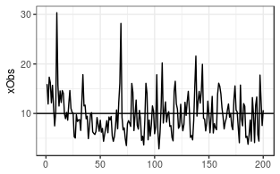
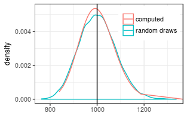

Generating observations and log-normally distributed random errors
------------------------------------------------------------------

We generate 10000 Observations of a sum of 100 random variables with
mean 10 and multiplicative standard deviation of 1.7.

    nObs <- 100; nRep <- 10000
    #nObs <- 1000; nRep <- 100
    xTrue <- rep(10, nObs)
    sigmaStar <- rep(1.7, nObs) # multiplicative stddev of 1.2
    theta <- getParmsLognormForExpval(xTrue, sigmaStar)
    # generate observations with correlated errors
    acf1 <- c(0.4,0.1)
    corrM <- setMatrixOffDiagonals(
      diag(nrow = nObs), value = acf1, isSymmetric = TRUE)
    xObsN <- exp(mvtnorm::rmvnorm(
      nRep, mean = theta[,1]
      , sigma = diag(theta[,2]) %*% corrM %*% diag(theta[,2])))

A single draw of the autocorrelated 100 variables looks like the
following.

    ##    Min. 1st Qu.  Median    Mean 3rd Qu.    Max. 
    ##   763.1   946.7   999.2  1001.5  1053.0  1337.1

Estimating the correlation matrix and effective number of parameters
--------------------------------------------------------------------

The autocorrelation used to generate the sample was:

    c(1, acf1)

    ## [1] 1.0 0.4 0.1

The effective one estimated from the sample is:

    (effAcf <- computeEffectiveAutoCorr(ds$xErr))

    ## [1] 1.000000000 0.208674342 0.007415853

    (nEff <- computeEffectiveNumObs(ds$xErr))

    ## [1] 70.04222

Due to autocorrelation, the effective number of parameters is less than
nObs = `R nObs`.

Computing the mean and its standard deviation
---------------------------------------------

First we compute the distribution parameter of the sum of the 100
variables. The multiplicative uncertainty has decreased.

    #coefSum <- estimateSumLognormal( theta[,1], theta[,2], effAcf = effAcf )
    coefSum <- estimateSumLognormal( theta[,1], theta[,2], effAcf = c(1,acf1) )
    exp(coefSum["sigma"])

    ##    sigma 
    ## 1.077687

Its expected value corresponds to the expected value (100\*10).

    (sumExp <- getLognormMoments( coefSum[1], coefSum[2])[1,"mean"])

    ## mean 
    ## 1000

The lognormal approximation of the distribution of the sum, is close to
the distribution of the 10000 repetitions.

