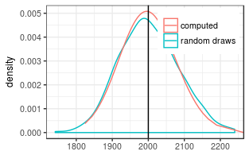

Aggregating a series of correlated lognormal variables
======================================================

Generating observations and log-normally distributed random errors
------------------------------------------------------------------

We generate 10000 Observations with mean 10 and multiplicative standard
deviation of 1.5.

    nObs <- 200; nRep <- 1000
    #nObs <- 1000; nRep <- 100
    xTrue <- rep(10, nObs)
    sigmaStar <- rep(1.5, nObs) # multiplicative stddev of 1.2
    theta <- getParmsLognormForExpval(xTrue, sigmaStar)
    # generate observations with correlated errors
    acf1 <- c(0.4,0.1)
    corrM <- setMatrixOffDiagonals(
      diag(nrow = nObs), value = acf1, isSymmetric = TRUE)
    xObsN <- exp(mvtnorm::rmvnorm(
      nRep, mean = theta[,1]
      , sigma = diag(theta[,2]) %*% corrM %*% diag(theta[,2])))
    ds <- tibble(i = 1:nObs, xTrue, xObs = xObsN[1,], xErr =  xObs - xTrue)
    summary(rowSums(xObsN))

    ##    Min. 1st Qu.  Median    Mean 3rd Qu.    Max. 
    ##    1742    1943    1997    2002    2056    2240

    #plot(density(rowSums(xObsN)))

\#\# Estimating the correlation matrix and effective number of
parameters

      (effAcf <- computeEffectiveAutoCorr(ds$xErr))

    ## [1] 1.0000000000 0.3464656576 0.0008852128 0.0764873035 0.0201459927

      (nEff <- computeEffectiveNumObs(ds$xErr))

    ## [1] 106.3046

Due to autocorrelation, the effective number of parameters is less than
nObs = `R nObs`.

Computing the mean and its standard deviation
---------------------------------------------

    coefSum <- estimateSumLognormal( theta[,1], theta[,2], effAcf = effAcf )
    (sumExp <- getLognormMoments( coefSum[1], coefSum[2])[1,"mean"])

    ## mean 
    ## 2000

