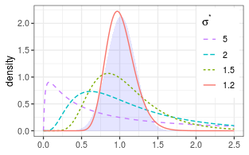
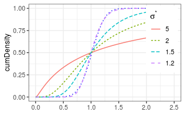
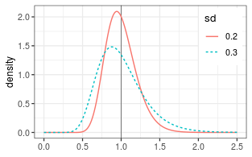

# Distribution
## Shape by multiplicative standard deviation

Density distributions of lognormal distributions (lines) 
get closer to normal density 
shaded area) as multiplicative standard deviation $\sigma^*$ decreases 
down to 1.2 for	same $\mu^* = 1$.





## Density, distribution function, quantile function and random generation

Are already provided with the base stats package.
See `?dlnorm`.

## Expected value, Variance, Mode, and Median


```r
getLognormMode(mu = 0.6,sigma = 0.5)
```

```
## [1] 1.419068
```

```r
getLognormMedian(mu = 0.6,sigma = 0.5)
```

```
## [1] 1.822119
```

```r
(theta <- getLognormMoments(mu = 0.6,sigma = 0.5))
```

```
##          mean      var        cv
## [1,] 2.064731 1.210833 0.5329404
```
Mode < Median < Mean for the right-skewed distribution.

The return type of `getLognormMoments` is a matrix.


# Parameter Estimation from moments


```r
moments <- cbind(mean = c(1,1), var = c(0.2, 0.3)^2 )
(theta <- getParmsLognormForMoments( moments[,1], moments[,2]))
```

```
##               mu     sigma
## [1,] -0.01961036 0.1980422
## [2,] -0.04308885 0.2935604
```



The larger the spread, the more skewed is the distribution, here both with
an expected value of one.
