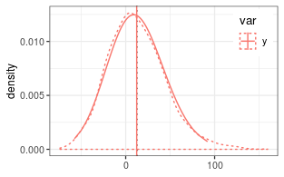
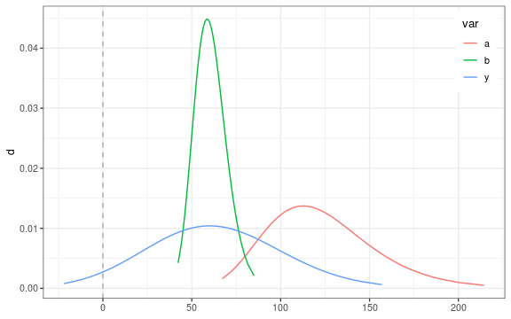
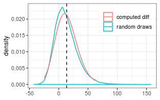
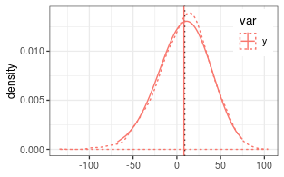

# Approximating the difference of lognormal random variables

Lo 2012 reports an approximation for the difference of two random variables by
a shifted lognormal distribution.

Rather than approximating the density of $y = a - b$, 
it approximates the density of $y_s = a - b + s$, where
$s$ is the shift. 
Hence, one has to subtract $s$ from provided mean and quantiles. One can
can use the variance, and relative error but has to recompute the relative error.

## Two uncorrelated random variables

```r
# generate nSample values of two lognormal random variables
mu1 = log(110)
mu2 = log(100)
sigma1 = 0.25
sigma2 = 0.15
#(coefDiff <- estimateSumLognormal( c(mu1,mu2), c(sigma1,sigma2) ))
(coefDiff <- estimateDiffLognormal(mu1,mu2, sigma1,sigma2, 0))
```

```
##           mu        sigma        shift 
##   6.14704349   0.06859943 456.07414434
```

```r
(expDiff <- getLognormMoments(coefDiff["mu"], coefDiff["sigma"])[,"mean"] - 
    coefDiff["shift"])
```

```
##     mean 
## 12.36042
```

Several functions accept the `shift` argument to handle this already.

```r
getLognormMoments(coefDiff["mu"], coefDiff["sigma"], shift = coefDiff["shift"])
```

```
##          mean     var       cv
## [1,] 12.36042 1035.05 2.602839
```

```r
getLognormMode(coefDiff["mu"], coefDiff["sigma"], shift = coefDiff["shift"])
```

```
##       mu 
## 9.065469
```

```r
getLognormMedian(coefDiff["mu"], coefDiff["sigma"], shift = coefDiff["shift"])
```

```
##       mu 
## 11.25952
```

For the functions from the stats package, the shifting has to be done
manually.

```r
p <- seq(0,1,length.out = 100)[-c(1,100)]
dsPredY <- data.frame(
  var = "y", 
  q_shifted = qlnorm(p, coefDiff["mu"], coefDiff["sigma"] )
) %>%
mutate( 
  q = q_shifted - coefDiff["shift"],
  d = dlnorm(q_shifted, coefDiff["mu"], coefDiff["sigma"])
)
```

A check by random numbers (dotted lines) shows close correspondence.



## Test if difference is significantly different from zero

The probability of the zero quantile needs to be larger than a significane 
level.
We can compute it based on the lognormal approximation.

Since Lo12 is only accurate if the expected difference is small compared
to the expected sum, the probiblity of the difference being larger than zero can be estimated by a sampling both terms.


```r
  mu1 = log(120)
  mu2 = log(60)
  sigma1 = 0.25
  sigma2 = 0.15
  coefDiff <- estimateDiffLognormal( mu1,mu2,sigma1,sigma2, corr = -0.8 )
```

```
## Warning in estimateDiffLognormal(mu1, mu2, sigma1, sigma2, corr = -0.8):
## Expected S0+/S0- << 1 but this ratio was 0.34219239671082. The Lo 2012
## approximation becomes inaccurate for small numbers a and b.
```

```r
  pLo <- plnorm(0 + coefDiff["shift"], coefDiff["mu"], coefDiff["sigma"])
  pSample <- pDiffLognormalSample(mu1,mu2,sigma1,sigma2, corr = -0.8)
```

```
## Loading required namespace: mvtnorm
```

```r
  c(pLo = as.numeric(pLo), pSample = pSample)
```

```
##        pLo    pSample 
## 0.04540137 0.03356000
```

In the example both approaches give a probability of less than 5% so
that we conclude that the difference is significant.



## Two positively correlated variables

```r
if (!requireNamespace("mvtnorm")) {
  warning("Remainder of the vignette required mvtnorm installed.")
  knitr::opts_chunk$set(error = TRUE) 
}
corr = 0.8
(coefDiff <- estimateDiffLognormal(mu1,mu2, sigma1,sigma2, corr = corr))
```

```
## Warning in estimateDiffLognormal(mu1, mu2, sigma1, sigma2, corr = corr):
## Expected S0+/S0- << 1 but this ratio was 0.34219239671082. The Lo 2012
## approximation becomes inaccurate for small numbers a and b.
```

```
##          mu       sigma       shift 
##   5.1762267   0.1264911 115.3050125
```

```r
(expDiff <- getLognormMoments(
  coefDiff["mu"], coefDiff["sigma"], shift = coefDiff["shift"])[,"mean"])
```

```
##    mean 
## 63.1304
```

Check with sampled distribution.

```r
nSample <- 1e5
sigma_vec = c(sigma1, sigma2)
corrM <- setMatrixOffDiagonals(
  diag(nrow = 2), value = corr, isSymmetric = TRUE)
covM <- diag(sigma_vec) %*% corrM %*% diag(sigma_vec)
xObsN <- exp(mvtnorm::rmvnorm(nSample, mean =  c(mu1, mu2), sigma = covM))
head(xObsN)
```

```
##           [,1]     [,2]
## [1,] 112.00008 68.54844
## [2,] 108.42828 54.98933
## [3,]  91.08837 49.65450
## [4,] 127.33532 64.70481
## [5,]  95.97672 57.82527
## [6,] 131.87339 65.77194
```

```r
y = xObsN[,1] - xObsN[,2]
```



The approximation for the difference of positively correlated random numbers 
predicts a 
narrower distribution than with the uncorrelated or negatively correlated difference above. However, this case less accurate and shows some deviations from the sampled distribution around the mode.

## Subtracting a variable with larger variance

The method of Lo12 requires $\sigma_b < \sigma_a$ and otherwise
gives an error.


```r
# generate nSample values of two lognormal random variables
mu1 = log(110)
mu2 = log(100)
sigma1 = 0.15
sigma2 = 0.25
try(coefDiff <- estimateDiffLognormal(mu1,mu2, sigma1,sigma2, 0))
```

```
## Error in estimateDiffLognormal(mu1, mu2, sigma1, sigma2, 0) : 
##   expected sigma_a > sigma_b but got 0.15 <= 0.25. Exchange the terms and negate the resulting quantiles (see vignette('lognormalDiff').
```

But one can compute the density of $y_r = -y = b - a$ and plot 
the density of the shifted and negated distribution.


```r
# note the switch of positions of mu1 and mu2: mu2 - mu1
#(coefDiff <- estimateDiffLognormal(mu1,mu2, sigma1,sigma2, 0)
(coefDiff <- estimateDiffLognormal(mu2,mu1, sigma2,sigma1, 0))
```

```
##           mu        sigma        shift 
##   6.10147970   0.06859943 455.64000921
```

```r
# note the minus sign in front
(expDiff <- -(getLognormMoments(
  coefDiff["mu"], coefDiff["sigma"], shift = coefDiff["shift"])[,"mean"]))
```

```
##     mean 
## 8.070146
```

```r
p <- seq(0,1,length.out = 100)[-c(1,100)]
dsPredY <- data.frame(
  var = "y", 
  q_shifted_neg = qlnorm(p, coefDiff["mu"], coefDiff["sigma"] )
) %>%
  mutate( 
    # note the minus sign in front
    q = -(q_shifted_neg - coefDiff["shift"]),
    d = dlnorm(q_shifted_neg, coefDiff["mu"], coefDiff["sigma"])
    )
```


Because we subtract a large-variance lognormal variable, the distribution
becomes right-skewed.

