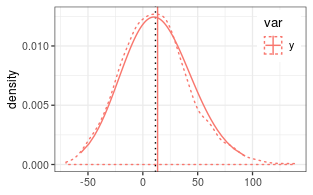
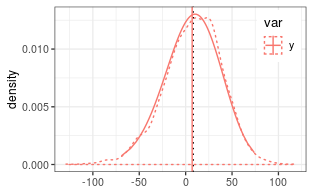

# Approximating the difference of lognormal random variables

Lo 2012 reports an approximation for the difference of two random variables by
a shifted lognormal distribution.

Rather than approximating the density of $y = a - b$, 
it approximates the density of $y_s = a - b + s$, where
$s$ is the shift. 
Hence, one has to subtract $s$ from provided mean and quantiles. One can
can use the variance, and relative error but has to recompute the relative error.

## Two uncorrelated random variables

```r
# generate nSample values of two lognormal random variables
mu1 = log(110)
mu2 = log(100)
sigma1 = 0.25
sigma2 = 0.15
#(coefSum <- estimateSumLognormal( c(mu1,mu2), c(sigma1,sigma2) ))
(coefSum <- estimateDiffLognormal(mu1,mu2, sigma1,sigma2, 0))
```

```
##           mu        sigma        shift 
##   6.14939140   0.06859943 456.07414434
```

```r
(expSum <- getLognormMoments(coefSum["mu"], coefSum["sigma"])[,"mean"] - 
    coefSum["shift"])
```

```
##     mean 
## 13.46156
```

Several functions accept the `shift` argument to handle this already.

```r
getLognormMoments(coefSum["mu"], coefSum["sigma"], shift = coefSum["shift"])
```

```
##          mean      var       cv
## [1,] 13.46156 1039.922 2.395548
```

```r
getLognormMode(coefSum["mu"], coefSum["sigma"], shift = coefSum["shift"])
```

```
##       mu 
## 10.15886
```

```r
getLognormMedian(coefSum["mu"], coefSum["sigma"], shift = coefSum["shift"])
```

```
##       mu 
## 12.35807
```

For the functions from the stats package, the shifting has to be done
manually.

```r
p <- seq(0,1,length.out = 100)[-c(1,100)]
dsPredY <- data.frame(
  var = "y", 
  q_shifted = qlnorm(p, coefSum["mu"], coefSum["sigma"] )
) %>%
mutate( 
  q = q_shifted - coefSum["shift"],
  d = dlnorm(q_shifted, coefSum["mu"], coefSum["sigma"])
)
```

A check by random numbers (dotted lines) shows close correspondence.



## Two positively correlated variables

```r
if (!requireNamespace("mvtnorm")) {
  warning("Remainder of the vignette required mvtnorm installed.")
  knitr::opts_chunk$set(error = TRUE) 
}
```

```
## Loading required namespace: mvtnorm
```

```r
mu_vec = c(mu1, mu2)
sigma_vec = c(sigma1, sigma2)
corr = 0.8
(coefSum <- estimateDiffLognormal(mu1,mu2, sigma1,sigma2, corr = corr))
```

```
##          mu       sigma       shift 
##   4.9869700   0.1264911 134.1394542
```

```r
(expSum <- getLognormMoments(coefSum["mu"], coefSum["sigma"])[,"mean"] - 
    coefSum["shift"])
```

```
##     mean 
## 13.52906
```

Check with sampled distribution.

```r
nSample <- 1e5
corrM <- setMatrixOffDiagonals(
  diag(nrow = 2), value = corr, isSymmetric = TRUE)
covM <- diag(sigma_vec) %*% corrM %*% diag(sigma_vec)
xObsN <- exp(mvtnorm::rmvnorm(nSample, mean = mu_vec, sigma = covM))
head(xObsN)
```

```
##           [,1]      [,2]
## [1,] 167.19675 149.74812
## [2,]  81.41488  84.53312
## [3,] 112.11649 108.98611
## [4,]  95.55639  94.32365
## [5,]  95.74721  84.57587
## [6,]  72.58698  81.90504
```

```r
y = xObsN[,1] - xObsN[,2]
```


The approximation for the difference of negatively correlated random numbers 
correcly predicts a 
narrower distribution but shows some differences around the mode.

## Subtracting a variable with larger variance

The method only works if the $\sigma_b < \sigma_a$ and otherwise
gives an error.


```r
# generate nSample values of two lognormal random variables
mu1 = log(110)
mu2 = log(100)
sigma1 = 0.15
sigma2 = 0.25
#(coefSum <- estimateSumLognormal( c(mu1,mu2), c(sigma1,sigma2) ))
try(coefSum <- estimateDiffLognormal(mu1,mu2, sigma1,sigma2, 0))
```

```
## Error in estimateDiffLognormal(mu1, mu2, sigma1, sigma2, 0) : 
##   expected sigma_a > sigma_b but got 0.15 <= 0.25. Exchange the terms and negate the resulting quantiles (see vignette('lognormalDiff').
```

But one can compute the density of $y_r = -y = b - a$ and plot 
the density of the shifted and negated distribution.


```r
# generate nSample values of two lognormal random variables
mu1 = log(110)
mu2 = log(100)
sigma1 = 0.15
sigma2 = 0.25
#(coefSum <- estimateSumLognormal( c(mu1,mu2), c(sigma1,sigma2) ))
(coefSum <- estimateDiffLognormal(mu2,mu1, sigma2,sigma1, 0))
```

```
##           mu        sigma        shift 
##   6.10382739   0.06859943 455.64000921
```

```r
(expSum <- -(getLognormMoments(coefSum["mu"], coefSum["sigma"])[,"mean"] - 
    coefSum["shift"]))
```

```
##     mean 
## 7.018159
```

```r
p <- seq(0,1,length.out = 100)[-c(1,100)]
dsPredY <- data.frame(
  var = "y", 
  q_shifted_neg = qlnorm(p, coefSum["mu"], coefSum["sigma"] )
) %>%
  mutate( 
    q = -(q_shifted_neg - coefSum["shift"]),
    d = dlnorm(q_shifted_neg, coefSum["mu"], coefSum["sigma"])
    )
```



