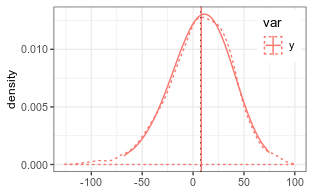

Approximating the difference of lognormal random variables
==========================================================

Lo 2012 reports an approximation for the difference of two random
variables by a shifted lognormal distribution.

Rather than approximating the density of *y* = *a* − *b*, it
approximates the density of *y**s* = *a* − *b* + *s*, where
*s* is the shift. Hence, one has to subtract *s* from provided mean and
quantiles. One can can use the variance, and relative error but has to
recompute the relative error.

Two uncorrelated random variables
---------------------------------

    # generate nSample values of two lognormal random variables
    mu1 = log(110)
    mu2 = log(100)
    sigma1 = 0.25
    sigma2 = 0.15
    #(coefSum <- estimateSumLognormal( c(mu1,mu2), c(sigma1,sigma2) ))
    (coefSum <- estimateDiffLognormal(mu1,mu2, sigma1,sigma2, 0))

    ##           mu        sigma        shift 
    ##   6.14704349   0.06859943 456.07414434

    (expSum <- getLognormMoments(coefSum["mu"], coefSum["sigma"])[,"mean"] - 
        coefSum["shift"])

    ##     mean 
    ## 12.36042

Several functions accept the `shift` argument to handle this already.

    getLognormMoments(coefSum["mu"], coefSum["sigma"], shift = coefSum["shift"])

    ##          mean     var       cv
    ## [1,] 12.36042 1035.05 2.602839

    getLognormMode(coefSum["mu"], coefSum["sigma"], shift = coefSum["shift"])

    ##       mu 
    ## 9.065469

    getLognormMedian(coefSum["mu"], coefSum["sigma"], shift = coefSum["shift"])

    ##       mu 
    ## 11.25952

For the functions from the stats package, the shifting has to be done
manually.

    p <- seq(0,1,length.out = 100)[-c(1,100)]
    dsPredY <- data.frame(
      var = "y", 
      q_shifted = qlnorm(p, coefSum["mu"], coefSum["sigma"] )
    ) %>%
    mutate( 
      q = q_shifted - coefSum["shift"],
      d = dlnorm(q_shifted, coefSum["mu"], coefSum["sigma"])
    )

A check by random numbers (dotted lines) shows close correspondence.

Test if difference is significantly different from zero
-------------------------------------------------------

The probability of the zero quantile needs to larger than a significane
level. We can compute it based on the lognormal approximation or by
repeatetly computing the difference from a sample of terms.

      mu1 = log(120)
      mu2 = log(60)
      sigma1 = 0.25
      sigma2 = 0.15
      coefSum <- estimateDiffLognormal( mu1,mu2,sigma1,sigma2, corr = -0.8 )

    ## Warning in estimateDiffLognormal(mu1, mu2, sigma1, sigma2, corr = -0.8):
    ## Expected S0+/S0- << 1 but this ratio was 0.34219239671082. The Lo 2012
    ## approximation becomes inaccurate for small numbers a and b.

      pLo <- plnorm(0 + coefSum["shift"], coefSum["mu"], coefSum["sigma"])
      pSample <- pDiffLognormalSample(mu1,mu2,sigma1,sigma2, corr = -0.8)
      c(pLo = as.numeric(pLo), pSample = pSample)

    ##        pLo    pSample 
    ## 0.04540137 0.03449000

In the example both approaches give a probability of less than 5% so
that we conclude that the difference is significant.

Two positively correlated variables
-----------------------------------

    if (!requireNamespace("mvtnorm")) {
      warning("Remainder of the vignette required mvtnorm installed.")
      knitr::opts_chunk$set(error = TRUE) 
    }
    corr = 0.8
    (coefSum <- estimateDiffLognormal(mu1,mu2, sigma1,sigma2, corr = corr))

    ## Warning in estimateDiffLognormal(mu1, mu2, sigma1, sigma2, corr = corr):
    ## Expected S0+/S0- << 1 but this ratio was 0.34219239671082. The Lo 2012
    ## approximation becomes inaccurate for small numbers a and b.

    ##          mu       sigma       shift 
    ##   5.1762267   0.1264911 115.3050125

    (expSum <- getLognormMoments(coefSum["mu"], coefSum["sigma"])[,"mean"] - 
        coefSum["shift"])

    ##    mean 
    ## 63.1304

Check with sampled distribution.

    nSample <- 1e5
    sigma_vec = c(sigma1, sigma2)
    corrM <- setMatrixOffDiagonals(
      diag(nrow = 2), value = corr, isSymmetric = TRUE)
    covM <- diag(sigma_vec) %*% corrM %*% diag(sigma_vec)
    xObsN <- exp(mvtnorm::rmvnorm(nSample, mean =  c(mu1, mu2), sigma = covM))
    head(xObsN)

    ##           [,1]     [,2]
    ## [1,] 129.12304 55.75530
    ## [2,] 128.58578 73.91592
    ## [3,] 107.37253 60.88385
    ## [4,]  95.20953 44.34412
    ## [5,] 118.57035 61.37689
    ## [6,] 122.10582 69.80982

    y = xObsN[,1] - xObsN[,2]

The approximation for the difference of negatively correlated random
numbers correcly predicts a narrower distribution than with the
uncorrelated difference but shows some deviations from the sampled
distribution around the mode.

Subtracting a variable with larger variance
-------------------------------------------

The method only works if the *σ**b* &lt; *σ**a*
and otherwise gives an error.

    # generate nSample values of two lognormal random variables
    mu1 = log(110)
    mu2 = log(100)
    sigma1 = 0.15
    sigma2 = 0.25
    #(coefSum <- estimateSumLognormal( c(mu1,mu2), c(sigma1,sigma2) ))
    try(coefSum <- estimateDiffLognormal(mu1,mu2, sigma1,sigma2, 0))

    ## Error in estimateDiffLognormal(mu1, mu2, sigma1, sigma2, 0) : 
    ##   expected sigma_a > sigma_b but got 0.15 <= 0.25. Exchange the terms and negate the resulting quantiles (see vignette('lognormalDiff').

But one can compute the density of
*y**r* =  − *y* = *b* − *a* and plot the density of the
shifted and negated distribution.

    # generate nSample values of two lognormal random variables
    mu1 = log(110)
    mu2 = log(100)
    sigma1 = 0.15
    sigma2 = 0.25
    #(coefSum <- estimateSumLognormal( c(mu1,mu2), c(sigma1,sigma2) ))
    (coefSum <- estimateDiffLognormal(mu2,mu1, sigma2,sigma1, 0))

    ##           mu        sigma        shift 
    ##   6.10147970   0.06859943 455.64000921

    (expSum <- -(getLognormMoments(coefSum["mu"], coefSum["sigma"])[,"mean"] - 
        coefSum["shift"]))

    ##     mean 
    ## 8.070146

    p <- seq(0,1,length.out = 100)[-c(1,100)]
    dsPredY <- data.frame(
      var = "y", 
      q_shifted_neg = qlnorm(p, coefSum["mu"], coefSum["sigma"] )
    ) %>%
      mutate( 
        q = -(q_shifted_neg - coefSum["shift"]),
        d = dlnorm(q_shifted_neg, coefSum["mu"], coefSum["sigma"])
        )

Because we subtract a large-variance lognormal variable, the
distribution becomes right-skewed.
