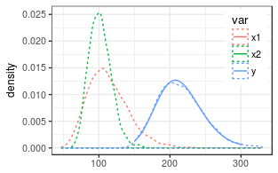

Approximating the sum of lognormal random variables
===================================================

Two uncorrelated random variables
---------------------------------

    # generate nSample values of two lognormal random variables
    mu1 = log(110)
    mu2 = log(100)
    sigma1 = 0.25
    sigma2 = 0.15
    (coefSum <- estimateSumLognormal( c(mu1,mu2), c(sigma1,sigma2) ))

    ##        mu     sigma 
    ## 5.3576474 0.1499077

A check by random numbers shows close correspondence.

For a test on correlated variables see the aggregateCorrelated vignette
([html](aggregateCorrelated.html) or [md](aggregateCorrelated.md)).
