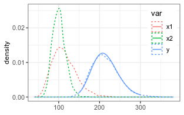
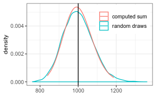
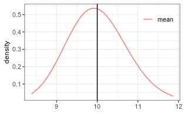

Approximating the sum of lognormal random variables
===================================================

Lo 2013 derived the following formula for the approximation of the sum
of several correlated lognormal random variables by a lognormal
distribution.
$$
\\begin{aligned}
S\_+ &= \\operatorname{E}\\left\[\\sum\_i X\_i \\right\] = \\sum\_i 
\\operatorname{E}\[X\_i\] = 
\\sum\_i 
e^{\\mu\_i + \\sigma\_i^2/2}        \\\\
\\sigma^2\_{S} &= 1/S\_+^2 \\, \\sum\_{i,j}
\\operatorname{cor}\_{ij} \\sigma\_i \\sigma\_j   \\operatorname{E}\[X\_i\] 
\\operatorname{E}\[X\_j\]       \\\\ 
 &= 1/S\_+^2 \\, \\sum\_{i,j}
\\operatorname{cor}\_{ij} \\sigma\_i \\sigma\_j   e^{\\mu\_i + \\sigma\_i^2/2} 
e^{\\mu\_j + \\sigma\_j^2/2}  \\\\
\\mu\_S &= \\ln\\left( S\_+ \\right) - \\sigma\_{S}^2/2 
\\end{aligned}
$$
 where *S*+ is the expected value of the sum, i.e the sum of
the expected values of the terms. *μ**s* and
*σ**S* are lognormal distribution parameters of the sum,
*μ**i* and *σ**i* are the lognormal distribution
parameters of the added random variables, and cor*i**j* is
the correlation between two added random variables at log scale, which
for time is computed from estimated autocorrelation *ρ**k*.

This method is implemented with function `estimateSumLognormal`, where
the full correlation matrix is specified. For computational efficiency,
the correlation length can be specified and correlations further apart
will not contribute to the sum.

Two uncorrelated random variables
---------------------------------

    # generate nSample values of two lognormal random variables
    mu1 = log(110)
    mu2 = log(100)
    sigma1 = 0.25
    sigma2 = 0.15
    (coefSum <- estimateSumLognormal( c(mu1,mu2), c(sigma1,sigma2) ))

    ##        mu     sigma 
    ## 5.3576474 0.1499077

A check by random numbers shows close correspondence.

Many correlated variables
-------------------------

### Generating observations and log-normally distributed random errors

We generate 10000 Observations of a sum of 100 random variables with
mean 10 and multiplicative standard deviation of 1.7.

    if (!requireNamespace("mvtnorm")) {
      warning("Remainder of the vignette required mvtnorm installed.")
      knitr::opts_chunk$set(error = TRUE) 
    }
    nObs <- 100; nRep <- 10000
    #nObs <- 1000; nRep <- 100
    xTrue <- rep(10, nObs)
    sigmaStar <- rep(1.7, nObs) # multiplicative stddev 
    theta <- getParmsLognormForExpval(xTrue, sigmaStar)
    # generate observations with correlated errors
    acf1 <- c(0.4,0.1)
    corrM <- setMatrixOffDiagonals(
      diag(nrow = nObs), value = acf1, isSymmetric = TRUE)
    xObsN <- exp(mvtnorm::rmvnorm(
      nRep, mean = theta[,1]
      , sigma = diag(theta[,2]) %*% corrM %*% diag(theta[,2])))

A single draw of the autocorrelated 100 variables looks like the
following.

### Estimating the correlation matrix and effective number of parameters

We can estimate the autocorrelation matrix by assuming that it depends
only on the distance in time, and estimate the autocorrelation matrix.

The original autocorrelation function used to generate the sample was:

    ## [1] 1.0 0.4 0.1

The effective autocorrelation function estimated from the sample is:

    (effAcf <- computeEffectiveAutoCorr(ds$xErr))

    ## [1] 1.00000000 0.29142196 0.09174139

    (nEff <- computeEffectiveNumObs(ds$xErr))

    ## [1] 56.92075

Due to autocorrelation, the effective number of parameters is less than
nObs = 100.

### Computing the mean and its standard deviation

First we compute the distribution parameter of the sum of the 100
variables. The multiplicative uncertainty has decreased from 1.7.

    #coefSum <- estimateSumLognormal( theta[,1], theta[,2], effAcf = effAcf )
    coefSum <- estimateSumLognormal( theta[,1], theta[,2], effAcf = c(1,acf1) )
    setNames(exp(coefSum["sigma"]), "sigmaStar")

    ## sigmaStar 
    ##  1.077687

Its expected value corresponds to the summ of expected values (100\*10).

    (sumExp <- getLognormMoments( coefSum[1], coefSum[2])[1,"mean"])

    ## mean 
    ## 1000

The lognormal approximation of the distribution of the sum, is close to
the distribution of the 10000 repetitions.

The mean is the sum devided by the number of observations, *n*. While
the multiplicatie standard deviation does not change by this operation,
the location parameter is obtained by deviding by *n* at original scale,
hence, subtracting *l**o**g*(*n*) at log-scale.

    (coefMean <- setNames(c(coefSum["mu"] - log(nObs), coefSum["sigma"]), c("mu","sigma")))

    ##        mu     sigma 
    ## 2.2997863 0.0748167

And we can plot the estimated distribution of the mean.

